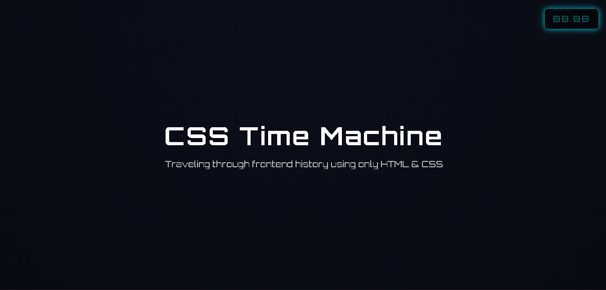
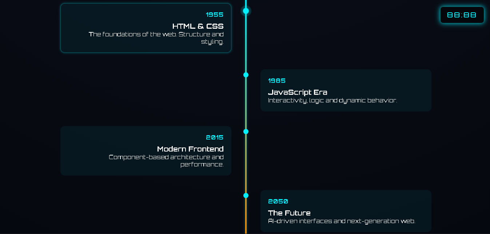

# ⚡ CSS Time Machine

> _Traveling through frontend history using only HTML & CSS_

[](https://developer.mozilla.org/en-US/docs/Web/HTML)
[](https://developer.mozilla.org/en-US/docs/Web/CSS)
[](https://fonts.google.com/specimen/Orbitron)

## 🚀 Live Demo

**[🌐 View Live Site](https://dzelhub.github.io/coding-through-time/)**

## 📸 Preview





## ✨ Features

- 🎯 **Pure CSS Magic** - No JavaScript, pure CSS animations
- ⏰ **Digital Clock** - CSS-only animated clock display
- 📈 **Interactive Timeline** - Hover effects and smooth transitions
- 🌟 **Glassmorphism Design** - Modern frosted glass effects
- 📱 **Responsive Layout** - Mobile-first design approach
- 🎨 **Custom CSS Variables** - Organized and maintainable styling
- ⚡ **Smooth Animations** - Entrance effects and hover transitions

## 🛠️ Technologies Used

- **HTML5** - Semantic structure and accessibility
- **CSS3** - Advanced styling with modern features:
  - CSS Grid & Flexbox
  - Custom Properties (CSS Variables)
  - Keyframe Animations
  - Backdrop Filters
  - Transform & Transitions

## 🎨 Design Features

- **Color Palette**: Cyberpunk-inspired with accent colors
- **Typography**: Orbitron font family for futuristic feel
- **Layout**: 100vh timeline with alternating content
- **Effects**: Glow animations and glassmorphism styling

## 🚀 Getting Started

1. **Clone the repository**

   ```bash
   git clone https://github.com/DZELhub/coding-through-time.git
   ```

2. **Navigate to project directory**

   ```bash
   cd coding-through-time
   ```

3. **Open in browser**
   ```bash
   # Simply open index.html in your preferred browser
   # Or use a local server
   python -m http.server 8000
   ```

## 📁 Project Structure

```
coding-through-time/
├── assets/
│   ├── main.png
│   └── timeline.png
├── index.html          # Main HTML structure
├── style.css           # Main stylesheet
├── style-old.css       # Backup styles
├── README.md
└── LICENSE
```

## 🎯 Project Highlights

- **CSS-Only Implementation** - Showcases the power of modern CSS
- **Timeline Visualization** - Interactive frontend technology evolution
- **Performance Optimized** - Clean, efficient code structure
- **Accessibility Focused** - Semantic HTML and proper contrast ratios

## 🔮 Future Enhancements

- [ ] Add more timeline milestones
- [ ] Implement theme switcher
- [ ] Add sound effects (CSS-based)
- [ ] Create mobile swipe interactions
- [ ] Implement CSS-only dark/light mode

## 💡 Learning Outcomes

This project demonstrates:

- Advanced CSS animation techniques
- CSS Grid and Flexbox mastery
- Responsive design principles
- Modern CSS features (Custom Properties, backdrop-filter)
- Clean code organization and maintenance

## 📄 License

This project is licensed under the MIT License - see the [LICENSE](LICENSE) file for details.

## 👨‍💻 Author

**D.Z.E.L**

[](https://www.linkedin.com/in/dzelalbinay/)
[](https://github.com/DZELhub)

---

<div align="center">
  <strong>⚡ Made with passion for clean, modern CSS ⚡</strong>
  <br>
  <em>If you found this project helpful, please consider giving it a ⭐</em>
</div>
